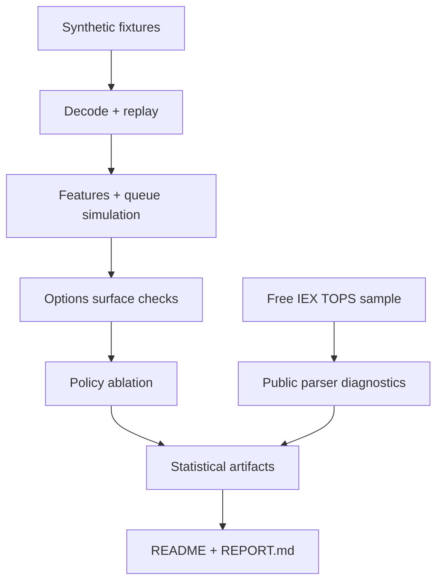
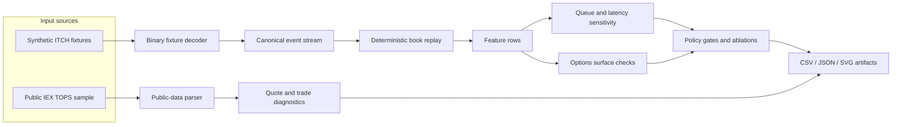
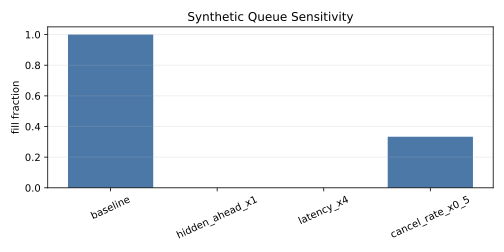
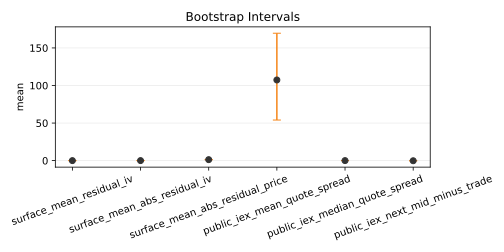
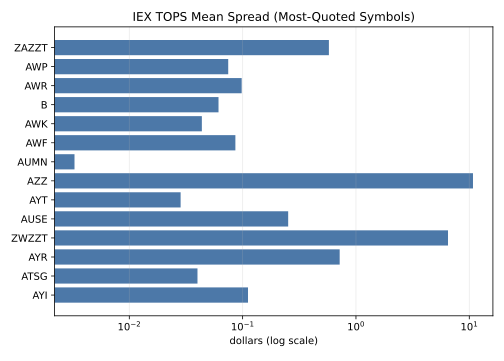

# VegaFlux

VegaFlux is my reproducible market-microstructure research repo. It takes small
synthetic market-data fixtures, runs them through decode/replay/features/fills,
adds options-surface and policy checks, then wraps the whole thing in a
statistical report with public-data provenance.

It focuses on the research-engineering pieces that make market-data experiments
auditable: deterministic replay, explicit data lineage, controlled sensitivity
studies, and report artifacts that can be regenerated from checked-in sources.

## What VegaFlux Demonstrates

- Deterministic replay and parser checks for canonical market-data fixtures.
- Queue and latency sensitivity analysis on controlled execution scenarios.
- Options-surface safety diagnostics and synthetic policy ablation artifacts.
- Public IEX TOPS quote/trade diagnostics with checksum-backed provenance.
- Reproducible tables and figures generated from checked-in CSV/JSON files.

## Shape Of The Project



## AegisFeed Replay Path



## Results Snapshot

| Area | Evidence |
| --- | --- |
| Public sample | 99,871 IEX TOPS messages; 63,640 parsed |
| Quote updates | 41,959 |
| Trade reports | 21,672 |
| Bootstrap policy | 2,000 percentile resamples, seed `424242`, only when `n >= 10` |
| Report | [REPORT.md](REPORT.md) |
| Machine summary | [artifacts/report/stats_summary.json](artifacts/report/stats_summary.json) |

## Charts

These SVGs are generated from checked-in CSV/JSON tables.







## Data

| Dataset | Path | Why it is here | Limit |
| --- | --- | --- | --- |
| Synthetic fixtures | `artifacts/*` | Controlled correctness and sensitivity evidence | Tiny by design |
| IEX TOPS sample | `data_contracts/fixtures/public_iex/20180127_IEXTP1_TOPS1.6.pcap.gz` | Free public quote/trade parser evidence | Top-of-book only; no individual queue |

IEX compressed SHA-256:
`ecfcef16491d3d6591b869e0db21164ed0fb9d2a491067f87fde40336f842d3b`

## Reproduce

```powershell
python python/scripts/generate_report.py
python -m json.tool artifacts/report/stats_summary.json
python -m json.tool artifacts/report/free_data_manifest.json
python -m json.tool artifacts/report/figures/figures_manifest.json
python python/scripts/clean_build_test.py
```

## Repo Map

| Path | Contents |
| --- | --- |
| `apps/`, `libs/`, `python/`, `tests/` | Core code and tests |
| `artifacts/` | Reproducible generated evidence |
| `artifacts/report/figures/` | Paper tables and rendered figures |
| `data_contracts/` | Schemas, manifests, and public fixture data |
| `proto/` | Canonical market schema |
| `REPORT.md` | Human-readable final report |
